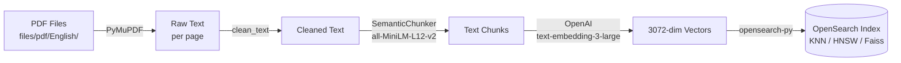
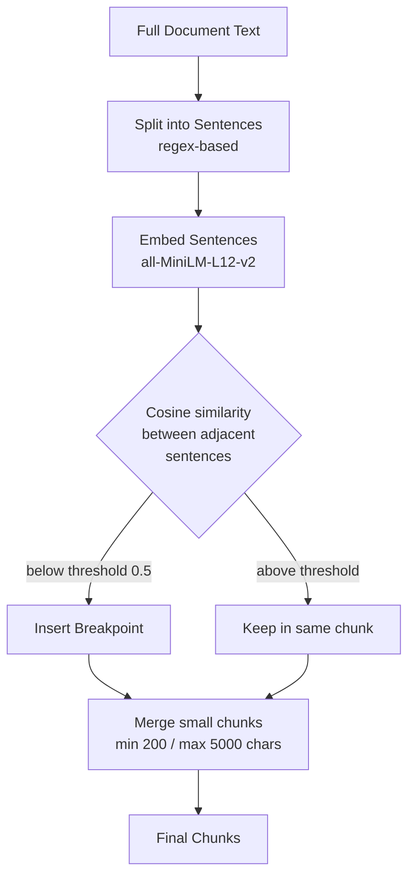

# OpenSearch POC — PDF Semantic Search

A proof-of-concept pipeline that ingests PDF documents, chunks them semantically, embeds the chunks with OpenAI, and stores them in OpenSearch for vector (KNN) similarity search.

---

## Overview

This project answers natural-language queries against a corpus of PDF files. Instead of keyword matching, it uses dense vector embeddings so that semantically similar content is retrieved even when exact words differ.

---

## Architecture

### Ingestion Pipeline



### Query Pipeline


### Semantic Chunking Detail



---

## Project Structure

```
opensearch-poc/
├── main.py                        # Entry point — ingestion + search loop
├── opensearch/
│   └── opensearch.py              # create_index, add_document, search, delete_index
├── sbert/
│   ├── chunking_class.py          # SemanticChunker + get_file_contents
│   └── iterations/                # Experimental chunking approaches
├── files/
│   └── pdf/
│       └── English/               # PDF files to ingest
├── pyproject.toml
└── .env                           # OPENAI_API_KEY (not committed)
```

---

## Prerequisites

| Requirement | Details |
|---|---|
| Python | >= 3.12 |
| OpenSearch | Running locally on `localhost:9200` with SSL — see [Docker setup](docs/docker.md) |
| OpenAI API key | `text-embedding-3-large` access |

### OpenSearch setup

See **[docs/docker.md](docs/docker.md)** for full Docker and Docker Compose instructions.

The client connects with:
- **Host:** `localhost:9200`
- **Auth:** `admin / StrongPassword123!`
- **SSL:** enabled, cert verification disabled (dev only)

---

## Setup

1. **Install dependencies**

   ```bash
   uv sync
   ```

2. **Create a `.env` file** in the project root:

   ```env
   OPENAI_API_KEY=sk-...
   ```

3. **Place PDFs** under `files/pdf/English/`.

---

## Running

```bash
python main.py
```

The script will:
1. Ingest and embed all PDFs into the `openai_rag_index_one` index.
2. Drop into an interactive search prompt.

```
Search: what is the vacation policy?
--- Search Results ---
Score (Similarity): 0.8921 | Text: Employees are entitled to...
File path: files\pdf\English\Vacation Policy 2025.pdf
...
Search: exit
```

Type `e` or `exit` to quit.

---

## Index Schema

| Field | Type | Details |
|---|---|---|
| `text_chunk` | `text` | Raw chunk text |
| `file_path` | `text` | Source PDF path |
| `embedding` | `knn_vector` | 3072-dim, HNSW, Faiss, cosine similarity |

---

## Deleting the Index

Uncomment the last line in `main.py`:

```python
delete_index(index_name="openai_rag_index_one")
```
