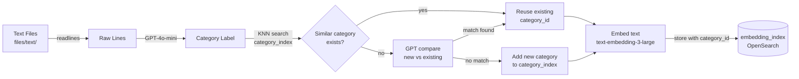

# OpenSearch POC — Memory RAG with Auto-Categorization

A pipeline that ingests plain-text notes/memories, auto-categorizes them using an LLM, embeds them with OpenAI, and stores them in OpenSearch for semantic (KNN) similarity search.

---

## Overview

Designed for personal memory retrieval — store notes, reminders, observations, or any free-form text. Each entry is automatically assigned a category via GPT, deduplicated against existing categories using vector similarity, then indexed as a KNN embedding for natural-language search.

---

## Architecture

### Ingestion Pipeline



### Query Pipeline


---

## Project Structure

```
opensearch-poc/
├── src/
│   ├── main.py                        # Entry point — ingestion + search loop
│   ├── categorizer/
│   │   ├── categorize.py              # get_category, check_similar_existing_category_else_return_new
│   │   └── prompt.py                  # CATEGORIZE_SYSTEM_PROMPT, COMPARE_CATEGORIES_SYSTEM_PROMPT
│   ├── embed/
│   │   └── embedder.py                # get_vectors (OpenAI text-embedding-3-large)
│   ├── opensearch/
│   │   ├── index.py                   # Index mappings: embedding_index, category_index
│   │   └── opensearch.py              # create_index, add_document, add_category,
│   │                                  # search_documents, search_similar_category, delete_index
│   └── sbert/
│       └── chunking_class.py          # SemanticChunker (sentence-transformers)
├── files/
│   └── text/                          # .txt files to ingest (one memory per line)
├── pyproject.toml
├── requirements.txt
└── .env                               # API keys (not committed)
```

---

## OpenSearch Indexes

### `embedding_index`
Stores text chunks with their vector embeddings and category reference.

| Field | Type | Details |
|---|---|---|
| `text_chunk` | `text` | Raw input text |
| `category_id` | `keyword` | Reference to a doc in `category_index` |
| `embedding` | `knn_vector` | 3072-dim, HNSW, Faiss, cosine similarity |

### `category_index`
Stores unique categories with their own embeddings for similarity search.

| Field | Type | Details |
|---|---|---|
| `category_id` | `keyword` | SHA1 of category name (also the `_id`) |
| `category_name` | `text` | Human-readable label |
| `embedding` | `knn_vector` | 3072-dim, HNSW, Faiss, cosine similarity |

> No native foreign key enforcement — `category_id` in `embedding_index` is an app-level reference to `_id` in `category_index`.

---

## Prerequisites

| Requirement | Details |
|---|---|
| Python | >= 3.12 |
| OpenSearch | Running locally on `localhost:9200` with SSL — see [Docker setup](docs/docker.md) |
| OpenAI API key | `text-embedding-3-large` + `gpt-4o-mini` access |

### OpenSearch setup

See **[docs/docker.md](docs/docker.md)** for Docker Compose instructions.

- **Host:** `localhost:9200`
- **Auth:** `admin / <OPENSEARCH_ADMIN_PASSWORD>`
- **SSL:** enabled, cert verification disabled (dev only)

---

## Setup

1. **Install dependencies**

   ```bash
   uv sync
   ```

2. **Create `.env`** in `src/opensearch/` and `src/categorizer/`:

   ```env
   OPENAI_API_KEY=sk-...
   OPENSEARCH_ADMIN_PASSWORD=YourPassword
   ```

   See `env.example` in each directory.

3. **Add text files** under `files/text/` — one memory/note per line, blank lines between entries.

---

## Running

```bash
python -m src.main
```

The script will:
1. Create `embedding_index` and `category_index` if they don't exist.
2. Read all `.txt` files from `files/text/`.
3. For each line: assign a category (GPT), match against existing categories (KNN + GPT comparison), embed and store.
4. Drop into an interactive search prompt.

```
Search: where did I park my car?
--- Search Results ---
Score (Similarity): 0.8734 | Category: transportation | Text: Parked my car at the west entrance...
-
Search: exit
```

Type `e` or `exit` to quit.

---

## Categorization Logic

Each new text entry goes through a two-step dedup check before creating a new category:

1. **KNN search** `category_index` for top-5 similar categories by embedding similarity
2. **If exact match found** in results → reuse that `category_id` directly
3. **Else → GPT comparison** of the new label vs. the top-5 names:
   - If semantically similar → reuse matched category
   - If truly new → call `add_category()` and embed it

This prevents category explosion (e.g., `automobile`, `car`, `vehicle` all map to `transportation`).

---

## Deleting Indexes

```python
from src.opensearch.opensearch import delete_index
delete_index("embedding_index")
delete_index("category_index")
```
