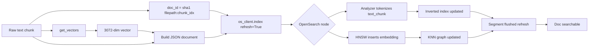
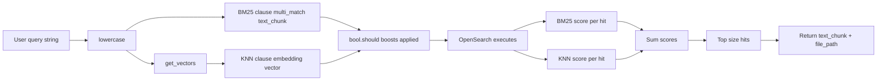
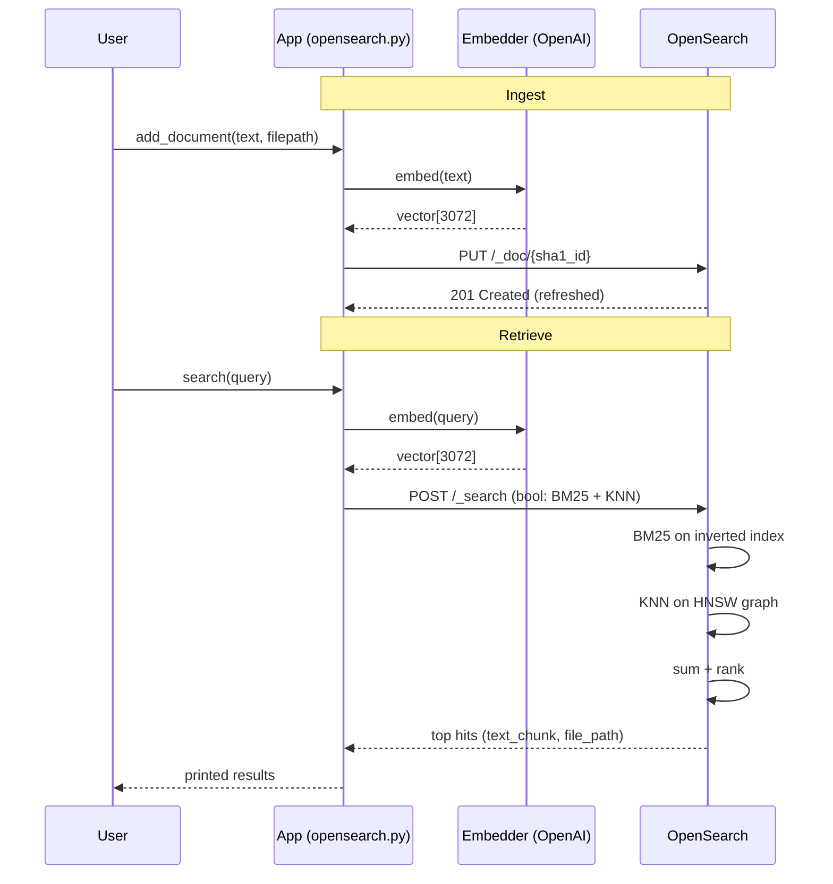

# How It Works

Beginner guide to what happens when a document enters the OpenSearch cluster, and how it comes back out during search. Matches the code in `opensearch.py`.

---

## 1. The Big Picture

Two flows:

1. **Ingest** — turn text into a searchable record.
2. **Retrieve** — turn a user query into matching records.

Both flows rely on the same trick: text is stored **twice**:

- as raw words (for keyword search, BM25)
- as a 3072-dim vector (for meaning-based search, KNN)

---

## 2. The Index

Before anything, an index must exist. Think of an index as a table with a schema (`mappings`).

```json
{
  "text_chunk":  "text",
  "file_path":   "text",
  "embedding":   "knn_vector (3072 dims, HNSW, cosine, faiss)"
}
```

- `text_chunk` → inverted index (BM25).
- `embedding` → HNSW graph (approximate nearest-neighbour).
- `file_path` → plain text field.

One-time setup via `create_index()`.

---

## 3. Ingest Flow

What happens on `add_document(index, chunk_idx, text, filepath)`:



Step-by-step:

1. **Embed** — `get_vectors()` calls OpenAI `text-embedding-3-large` → float array of length 3072.
2. **Hash ID** — deterministic: `sha1(filepath:chunk_idx)`. Re-ingesting same chunk overwrites, no duplicates.
3. **POST to OpenSearch** — JSON body `{text_chunk, embedding, file_path}`.
4. **Analyzer** — splits `text_chunk` into lowercase tokens, drops punctuation. Each token → posting list entry.
5. **HNSW insert** — embedding added as a node in a layered graph. Edges connect close neighbours by cosine distance.
6. **Refresh** — `refresh=True` forces immediate segment flush. Doc visible to search right away (slower ingest, good for demos).

---

## 4. Retrieve Flow (Hybrid BM25 + KNN)

What happens on `search(index, user_query)`:



Step-by-step:

1. **Normalize** — lowercase query, reuse same text for embedding + keyword match.
2. **Embed query** — same model as ingest, otherwise vectors live in different spaces and scores are meaningless.
3. **Build hybrid query** — a `bool` with two `should` clauses:
   - `multi_match` → BM25 keyword match on `text_chunk`.
   - `knn` → approximate nearest-neighbour over `embedding`.
   - Per-clause `boost` weights (`bm25_weight`, `vector_weight`) tilt the balance.
4. **Execute** — each shard runs both clauses, sums the scores per doc.
5. **Rank + return** — top `size` hits. `_source` filter limits response to `text_chunk` + `file_path` (skips the huge embedding array → smaller payload, faster).

---

## 5. BM25 vs KNN in One Line Each

| Method | Matches on | Good at | Weak at |
|--------|------------|---------|---------|
| BM25   | Exact/near tokens | Rare terms, names, IDs | Synonyms, paraphrase |
| KNN    | Semantic vector | Meaning, paraphrase | Exact string, acronyms |

Hybrid = both strengths, fewer blind spots.

---

## 6. Why Scores Are Weighted

BM25 scores are unbounded (log-ish). KNN cosine scores sit in a narrow range. Adding them raw overweights BM25. Boosts (`vector_weight=1.5`, `bm25_weight=1.0`) are a crude rebalance. Tune on your data.

---

## 7. End-to-End Sequence



---

## 8. Mental Model Cheatsheet

- **Index** = table with schema.
- **Document** = one row (one text chunk).
- **Embedding** = coordinates of the chunk in meaning-space.
- **Inverted index** = word → docs lookup (powers BM25).
- **HNSW graph** = proximity graph (powers KNN).
- **Hybrid search** = ask both, sum scores, pick winners.

That's the whole loop.
