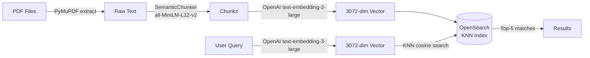

# OpenSearch RAG — Setup & Run Guide

Minimal RAG (Retrieval-Augmented Generation) proof-of-concept using OpenSearch as the vector store and OpenAI embeddings for semantic search over PDF documents.

---

## Architecture Overview



**Indexing:** PDFs extracted, semantically chunked, each chunk embedded into a 3072-dim vector and stored with its source file path.
**Search:** query embedded with same model, top-5 closest chunks returned by cosine similarity.

---

## Directory Structure

```
OPENSEARCH-POC/
├── main.py                  # Pipeline entry point (ingest + interactive search)
├── pyproject.toml
├── .env                     # API keys + OpenSearch password (not committed)
├── files/pdf/English/       # Source PDFs to ingest
├── embed/
│   └── embedder.py          # OpenAI embedding client (get_vectors)
├── sbert/
│   └── chunking_class.py    # SemanticChunker + get_file_contents
└── opensearch/
    ├── docker-compose.yaml  # OpenSearch + Dashboards containers
    ├── opensearch.py        # create_index / add_document / search / delete_index
    └── docs/
        └── run.md           # This file
```

---

## Prerequisites

- [Docker Desktop](https://www.docker.com/products/docker-desktop/) running
- Python 3.10+
- `uv` (preferred) or `pip`
- OpenAI API key with access to `text-embedding-3-large`

---

## 1. Environment Setup

Create `.env` in project root:

```
OPENAI_API_KEY=your-openai-api-key-here
OPENSEARCH_ADMIN_PASSWORD=YourStrongPassword123!
```

> `OPENSEARCH_ADMIN_PASSWORD` is read by both `docker-compose.yaml` and `opensearch/opensearch.py`. Must satisfy OpenSearch password policy (min 8 chars, mixed case, digit, symbol).

Install dependencies:

```bash
uv sync
```

Or with pip:

```bash
pip install opensearch-py openai python-dotenv pymupdf sentence-transformers
```

Place PDFs to ingest under `files/pdf/English/`.

---

## 2. Start OpenSearch

From `opensearch/` directory:

```bash
docker compose up -d
```

Brings up two containers:

| Service | Port | Purpose |
|---|---|---|
| `opensearch-local` | `9200` | REST API |
| `opensearch-dashboards` | `5601` | Web UI |

Verify:

```bash
docker ps
curl -k -u admin:$OPENSEARCH_ADMIN_PASSWORD https://localhost:9200
```

Dashboards UI: http://localhost:5601 (login `admin` / `$OPENSEARCH_ADMIN_PASSWORD`).

Stop:

```bash
docker compose down
```

---

## 3. Run the Pipeline

From project root:

```bash
python main.py
```

Pipeline:
1. Discover all PDFs under `files/pdf/English/`.
2. Extract + clean text per page (PyMuPDF).
3. Semantic chunking via `SemanticChunker` (`all-MiniLM-L12-v2` + cosine breakpoints).
4. Embed each chunk with `text-embedding-3-large`, index into `openai_rag_index_one`.
5. Enter interactive loop — prompt `Search: `, print top-5 hits per query. Type `e` or `exit` to quit.

---

## 4. Code Walkthrough

### `opensearch/opensearch.py`

Module-level `os_client`: connects to `localhost:9200` with `OPENSEARCH_ADMIN_PASSWORD` from env, SSL on, cert verification off (local Docker only).

#### `create_index(index_name="my-openai-rag-index")`

Creates index with three fields. Idempotent — skips if index exists.

| Field | Type | Detail |
|---|---|---|
| `text_chunk` | `text` | Raw chunk text, full-text searchable |
| `file_path` | `text` | Source PDF path for traceability |
| `embedding` | `knn_vector` | 3072-dim, HNSW, Faiss engine, cosine similarity |

Dimension **must** match `text-embedding-3-large` output (3072).

#### `add_document(index_name, doc_id, text, filepath)`

1. `get_vectors(text)` → 3072-dim embedding (via `embed.embedder`, OpenAI call).
2. Stores `{ text_chunk, embedding, file_path }` under `doc_id`.
3. `refresh=True` → immediately searchable.

#### `search(index_name, user_query)`

1. Embed `user_query` same model.
2. KNN query on `embedding` field, `k=5`, `size=5`.
3. Prints score, text chunk, source file path per hit.

#### `delete_index(index_name)`

Drops index. Call before rerunning with fresh data.

### `embed/embedder.py`

Thin wrapper on OpenAI SDK. `get_vectors(text)` → list[float] via `text-embedding-3-large`.

### `main.py`

Orchestrates the full pipeline — see step 3.

---

## 5. Index Management

List indices:

```bash
curl -k -u admin:$OPENSEARCH_ADMIN_PASSWORD https://localhost:9200/_cat/indices?v
```

Delete index (reindex from scratch):

```bash
curl -k -u admin:$OPENSEARCH_ADMIN_PASSWORD -X DELETE https://localhost:9200/openai_rag_index_one
```

Or uncomment `delete_index(...)` at bottom of `main.py`.

Inspect a stored document:

```bash
curl -k -u admin:$OPENSEARCH_ADMIN_PASSWORD https://localhost:9200/openai_rag_index_one/_doc/1
```

---

## 6. Configuration Reference

| Parameter | Location | Value | Notes |
|---|---|---|---|
| OpenSearch host | `opensearch/opensearch.py` | `localhost:9200` | Change for remote deployments |
| Admin password | `.env` → `OPENSEARCH_ADMIN_PASSWORD` | user-set | Consumed by both compose + client |
| Embedding model | `embed/embedder.py` | `text-embedding-3-large` | Dimension must stay 3072 |
| Index name | `main.py` | `openai_rag_index_one` | Change freely; recreate index after |
| PDF source dir | `main.py` → `BASE_PATH` | `files\pdf\English` | Windows-style path |
| Chunker model | `sbert/chunking_class.py` | `all-MiniLM-L12-v2` | Local sentence-transformer |
| JVM heap | `docker-compose.yaml` | `512m` | Increase for larger datasets |
| KNN results (`k`, `size`) | `opensearch/opensearch.py` `search()` | `5` | Adjust for more/fewer results |

---

## 7. Troubleshooting

- **Container exits on startup** → password does not meet policy. Set stronger `OPENSEARCH_ADMIN_PASSWORD` in `.env`, `docker compose down -v`, restart.
- **401 Unauthorized** → env var not loaded by shell. Verify `echo $OPENSEARCH_ADMIN_PASSWORD`.
- **`knn` query errors** → index created without `index.knn: true`. Delete + recreate.
- **Dimension mismatch on index** → embedding model changed. Drop index and reingest.
