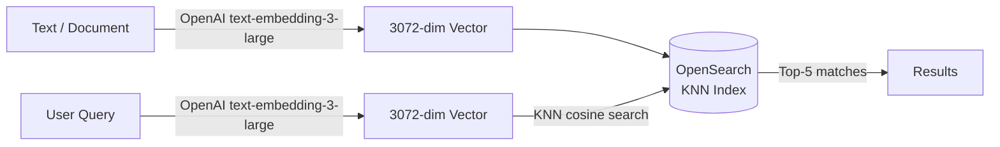

# OpenSearch RAG — Setup & Run Guide

A minimal RAG (Retrieval-Augmented Generation) proof-of-concept using OpenSearch as the vector store and OpenAI embeddings for semantic search.

---

## Architecture Overview



**Indexing:** each document is converted to a 3072-dim embedding and stored alongside its raw text in OpenSearch.
**Search:** the user query goes through the same embedding model, and the top-5 closest documents are returned by cosine similarity.

---

## Directory Structure

```
opensearch/
├── docker-compose.yaml   # Single-node OpenSearch container
├── .env                  # API keys (not committed)
├── main.py               # Indexing + search logic
└── docs/
    └── run.md            # This file
```

---

## Prerequisites

- [Docker Desktop](https://www.docker.com/products/docker-desktop/) running
- Python 3.10+
- `uv` or `pip` for package management
- An OpenAI API key with access to `text-embedding-3-large`

---

## 1. Environment Setup

Create the `.env` file in the `opensearch/` directory:

```
OPENAI_API_KEY=your-openai-api-key-here
```

Install Python dependencies:

```bash
pip install opensearch-py openai python-dotenv
```

---

## 2. Start OpenSearch

From the `opensearch/` directory:

```bash
docker compose up -d
```

Verify the container is running and healthy:

```bash
docker ps
```

Check the OpenSearch REST API is reachable:

```bash
curl -k -u admin:StrongPassword123! https://localhost:9200
```

You should receive a JSON response with cluster info. To stop the container:

```bash
docker compose down
```

---

## 3. Run the Script

From the `opensearch/` directory:

```bash
python main.py
```

This will:
1. Create the index `my-openai-rag-index` (skips if it already exists)
2. Embed and index 3 sample documents
3. Run a semantic search query and print the top-5 results with similarity scores

---

## 4. Code Walkthrough

### Client Initialisation (`main.py` top-level)

Two clients are initialised at module load:

- **`openai_client`** — connects to the OpenAI API using `OPENAI_API_KEY` from `.env`
- **`os_client`** — connects to the local OpenSearch container at `localhost:9200` with SSL enabled but certificate verification disabled (acceptable for local Docker only)

### `create_index()`

Creates the index with two fields:

| Field | Type | Detail |
|---|---|---|
| `text_chunk` | `text` | Raw document text, full-text searchable |
| `embedding` | `knn_vector` | 3072-dim float vector, HNSW algorithm, Faiss engine, cosine similarity |

The dimension **must** match the output of `text-embedding-3-large` (3072). Idempotent — safe to call multiple times.

### `add_document(doc_id, text)`

1. Calls `text-embedding-3-large` to get a 3072-dim embedding for `text`
2. Stores `{ text_chunk, embedding }` in the index under `doc_id`
3. Uses `refresh=True` so the document is immediately searchable

### `search(user_query)`

1. Embeds `user_query` using the same `text-embedding-3-large` model
2. Runs a KNN query against the `embedding` field, retrieving the top-5 nearest neighbours by cosine similarity
3. Prints each result's similarity score and source text

> The query must use the same embedding model as indexing — mixing models will produce incorrect similarity scores.

---

## 5. Index Management

List all indices:

```bash
curl -k -u admin:StrongPassword123! https://localhost:9200/_cat/indices?v
```

Delete the index (to reindex from scratch):

```bash
curl -k -u admin:StrongPassword123! -X DELETE https://localhost:9200/my-openai-rag-index
```

Inspect a stored document (replace `1` with the doc ID):

```bash
curl -k -u admin:StrongPassword123! https://localhost:9200/my-openai-rag-index/_doc/1
```

---

## 6. Configuration Reference

| Parameter | Location | Value | Notes |
|---|---|---|---|
| OpenSearch host | `main.py` | `localhost:9200` | Change for remote deployments |
| Admin password | `main.py` + `docker-compose.yaml` | `StrongPassword123!` | Must match in both files |
| Embedding model | `main.py` | `text-embedding-3-large` | Dimension must stay 3072 |
| Index name | `main.py` | `my-openai-rag-index` | Change freely, recreate index after |
| JVM heap | `docker-compose.yaml` | `512m` | Increase for larger datasets |
| KNN results (`k`) | `main.py` `search()` | `5` | Adjust for more/fewer results |
