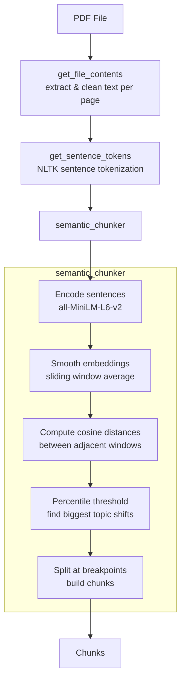
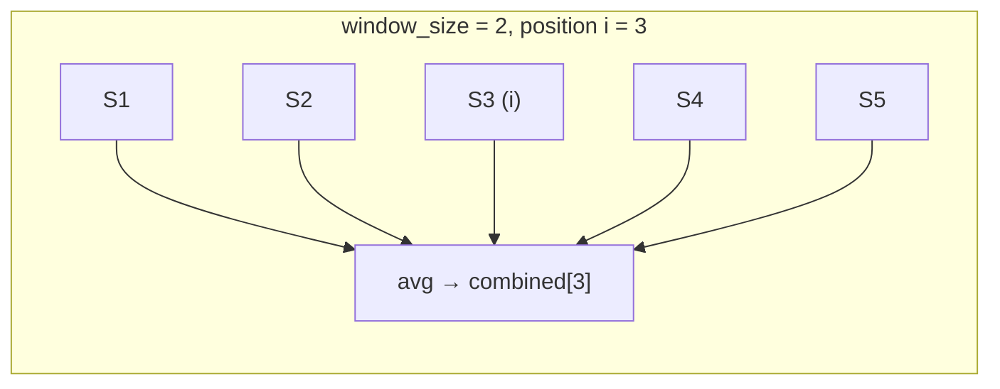
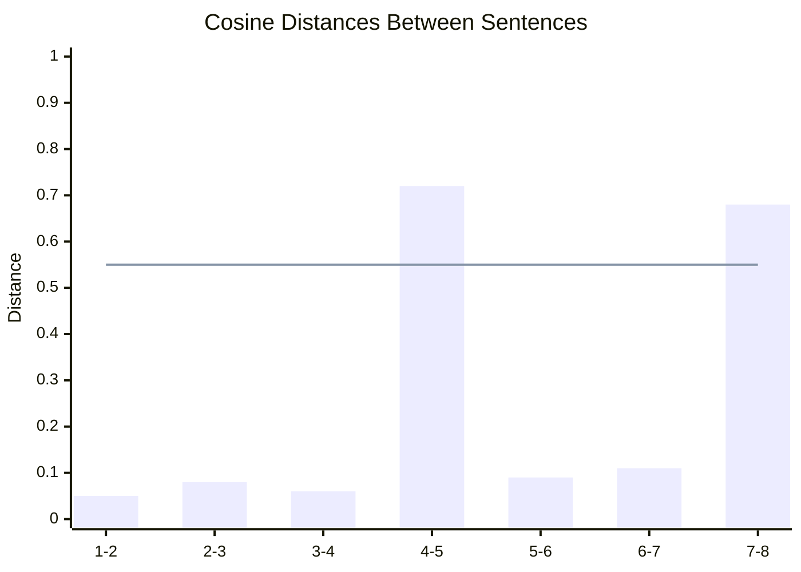

# Semantic Chunker

`chunks.py` splits a PDF document into topically coherent text chunks using semantic similarity rather than fixed-size rules.

## Pipeline Overview



## How `semantic_chunker` Works

The function groups sentences into topically coherent chunks by detecting where the meaning shifts significantly. It uses a **buffer/sliding-window** approach rather than splitting on hard rules like paragraph breaks or token counts.

### Step-by-Step

**1. Embed sentences**
Each sentence is encoded into a dense vector using `all-MiniLM-L6-v2`. These vectors capture semantic meaning.

**2. Smooth embeddings with a sliding window**
For each sentence at position `i`, a combined embedding is computed by averaging all embeddings within `[i - window_size, i + window_size]`. This blurs sharp local variations and gives a more stable signal of the local topic context.

**3. Compute cosine distances between adjacent combined embeddings**

```
distance[i] = 1 - cosine_similarity(combined[i], combined[i+1])
```

A high distance means the topic shifted; low distance means continuity.

**4. Threshold using a percentile**

```
breakpoint_threshold = np.percentile(distances, threshold_percentile)
```

Only the top `(100 - threshold_percentile)%` largest distances are treated as real topic breaks.

**5. Build chunks**
Sentences within a chunk are joined with spaces. A new chunk starts whenever a distance exceeds the threshold.

### Sliding Window Illustration



### Breakpoint Detection



> Bars above the threshold line (e.g., positions 4-5 and 7-8) become chunk boundaries.

---

## Parameters

| Parameter | Default | Effect |
|---|---|---|
| `window_size` | `3` | Size of the averaging window around each sentence. **Larger** = more smoothing, less sensitive to local shifts → **fewer, broader chunks**. **Smaller** = more sensitive to abrupt topic changes → **more, finer-grained chunks**. |
| `threshold_percentile` | `90` | Percentile cutoff for what counts as a real topic shift. **Higher** (e.g. `95`) = only the most dramatic shifts split a chunk → **fewer, larger chunks**. **Lower** (e.g. `70`) = more splits → **many small chunks**. |

### Parameter Interaction

```mermaid
quadrantChart
    title Chunk behaviour by parameter settings
    x-axis "Low window_size" --> "High window_size"
    y-axis "Low threshold_percentile" --> "High threshold_percentile"
    quadrant-1 Few large chunks
    quadrant-2 Moderate chunks\n(smooth + aggressive split)
    quadrant-3 Many small chunks
    quadrant-4 Moderate chunks\n(noisy + conservative split)
```

---

## Key Tradeoff

- `window_size` controls **smoothness of detection** — how much neighbouring context influences where a boundary is perceived.
- `threshold_percentile` controls **selectivity of splitting** — how dramatic a shift must be before it becomes a boundary.

The `__main__` block uses `window_size=2` (sharper detection) with `threshold_percentile=95` (very selective splits) to balance sensitivity with chunk size.
